 
<h1>Proyecto Final - Curso React Js Vite Comision 39660 CoderHouse</h1>
 
<h1> Demo: https://alacachufleta.netlify.app </h1>
 

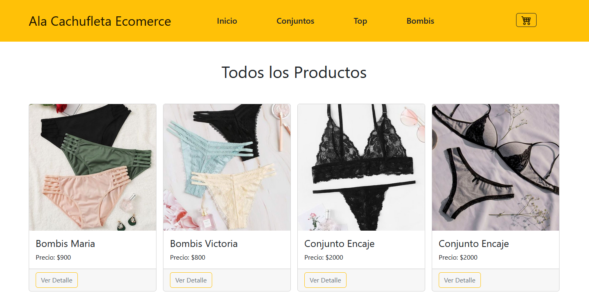

En el desarrollo de este proyecto se aplicaron las siguientes herramientas:

✔️ Bootstrap  
✔️ Css  
✔️ GitHube  
✔️ Firebase - Firestore  
✔️ Netfily  

<h2> 🧑‍💻 React Js Vite </h2>

➖ Instalación y configuración del entorno  
➖ JSX y transpiling  
➖ Componentes  
➖ Promises, asincronía y MAP  
➖ Consumir API's (modelo cliente - servidor)  
➖ Hooks, Estados, Props, Children y Patrones  
➖ Montaje - Actualizacion - Desmontaje  
➖ Routing y navegación  
➖ Eventos (intercambiabilidad - abstraccion)  
➖ Context (Contex Provaider - Custom Provider)  
➖ Técnicas de rendering  
➖ Firebase  
➖ Optimizacion de codigo  
➖ Documentar el Proyecto  

<h2> Descripcion del Proyecto </h2>

➕ El proyecto consiste en una ecommerce de venta de ropa interior, con diferentes categorias a poder elejir,
    en la seccion inicio se pueden ver las tarjetas con la categoria, nombre del producto, precio y un 
"boton de detalle" que deriva a otra vista.

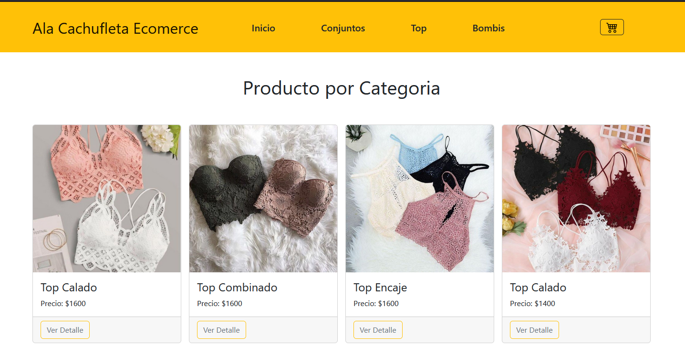 

➕ Y todo proviniente de la base de datos de Firebase.
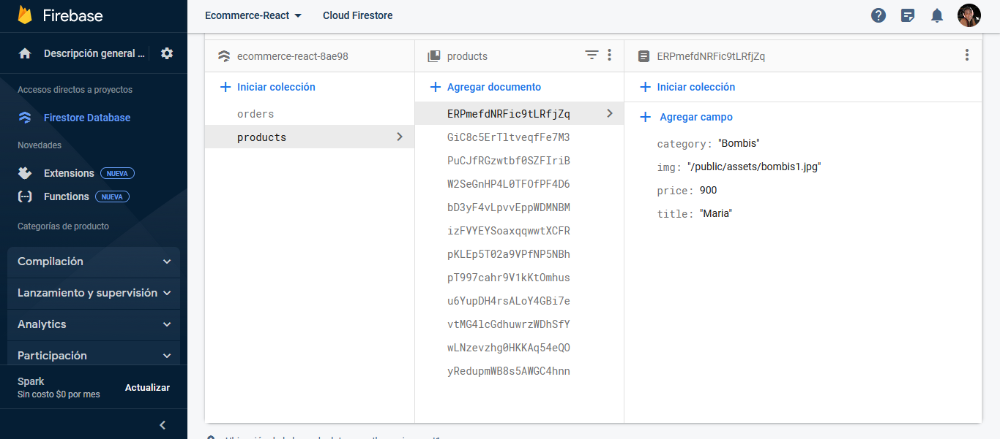 

<h2> Seccion detalle del producto </h2>
➕ En esta seccion podemos ver mas informacion del producto, y encontramos que podemos incrementar o decrementar la 
   cantidad a comprar y luego agregar el producto a neustro carrito de compras, llevandonos a una nueva vista con otras opciones

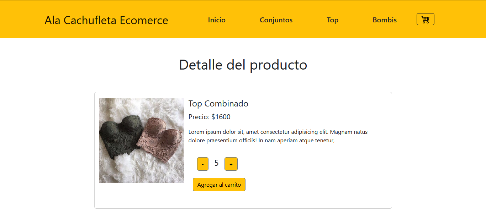 

<h2>  Seccion Ir al Carrito o Seguir Comprando </h2>

➕ En esta vista podemos ir a nuestro carrito de compras por medio del boton "ir al carrito" de la card o por "icono del carrito" que    ya tiene la cantidad de productos agrupados, de lo contrario volver al inicio por medio del boton "seguir comprando" o elijiendo      por categoria en la seccion de menu de la barra de navegacion para seguir comprando.

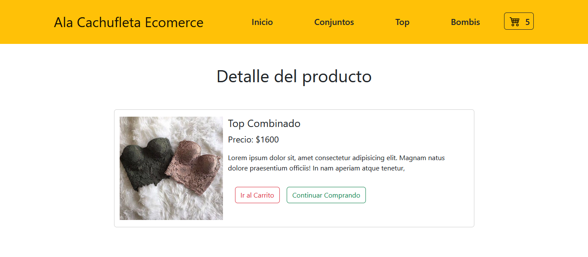  

<h2>  Seccion Carrito de Compras </h2>
➕ Esta seccion consta de toda la informacion de los productos agrgados con el subTotal de la compra y el total, tiene un boton que      "elimina por item" o de lo contrario un boton de "vaciar el carrito"

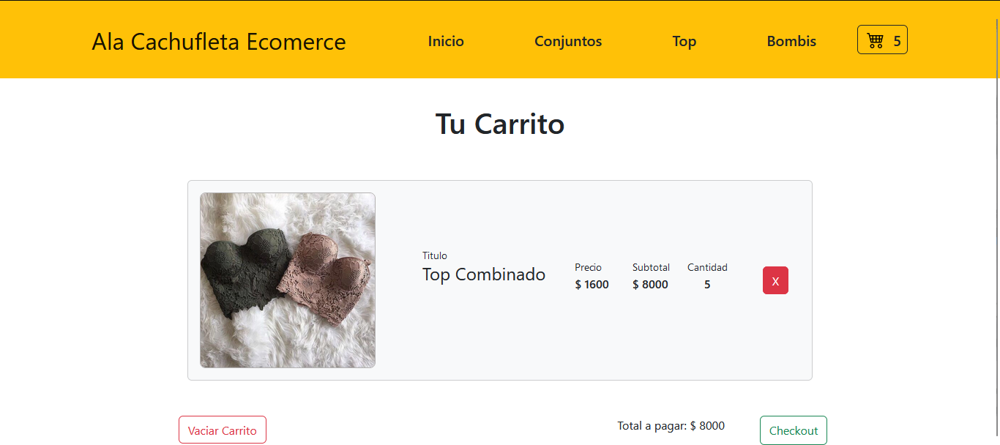  

➕ Pero tambien si el carrito se encuentra vacio muestra un cartel informando al comprador y con un boton que deriba a comprar.          Tambien consta de un boton de "Checkout" que conforme a la compra deriva a un formulario.

 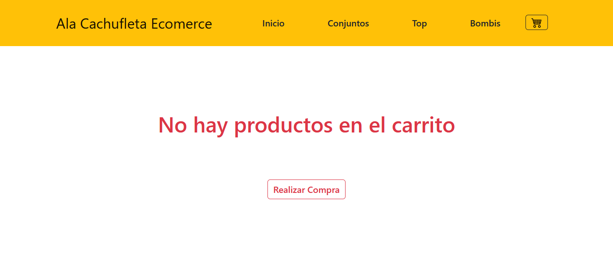  

<h2>  Seccion Formulario </h2>
➕ En esta seccion es para llenar los datos del cliente mediante un formulario el cual valida los campos que no esten vacios.
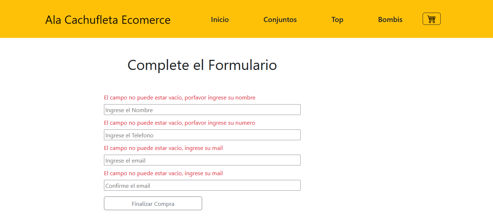 

➕ Tambien valida que confirme el email y que sea correcto de lo contrario informa que debe ingresarlo bien.
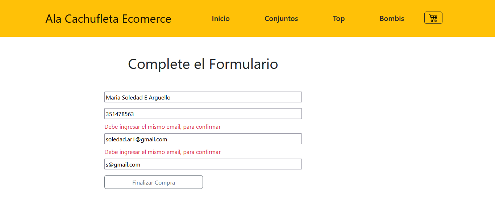 

➕ Y de ingresar todo correctamente genera la orden de la compra.
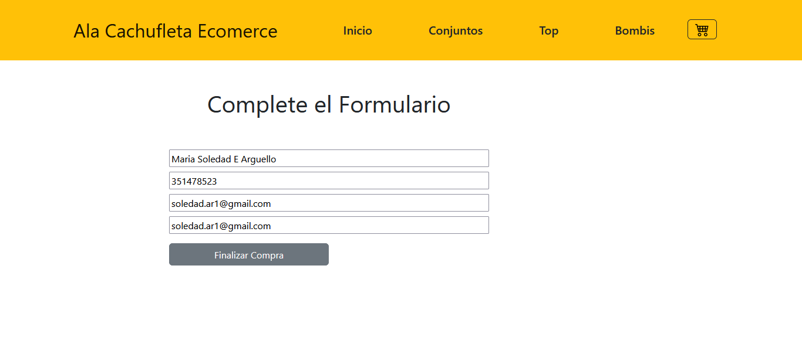 

<h2>  Seccion Orden Generada y finalizacion de la compra</h2>
➕ Una vez que el cliente completa el formulario correctamente se genera la orden de la compra, mostrando el numero de orden y un        boton que deriva nuevamente al inicio a la seccion de los productos. 
 

➕ La compra es enviada a la base de datos de firebase con los datos del cliente y los productos que agrego al carrito.
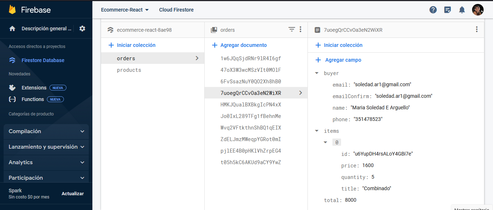 

  
